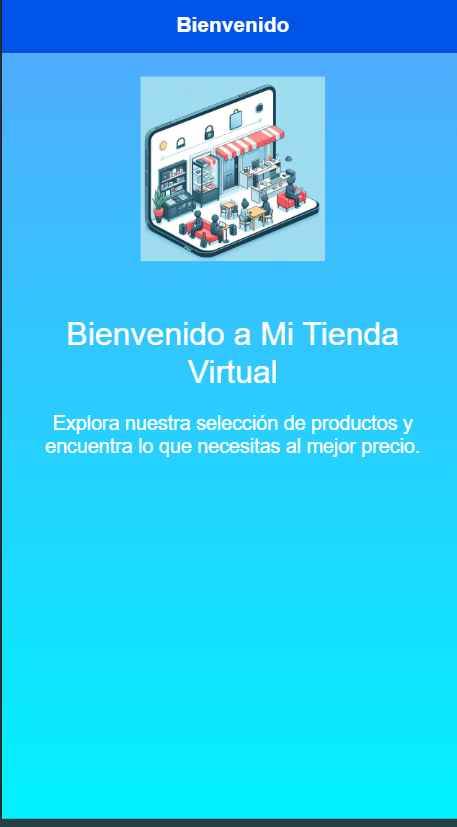
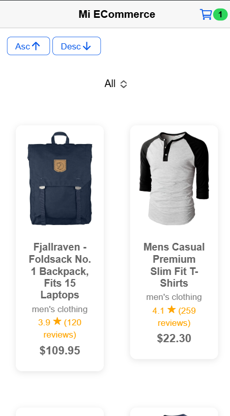
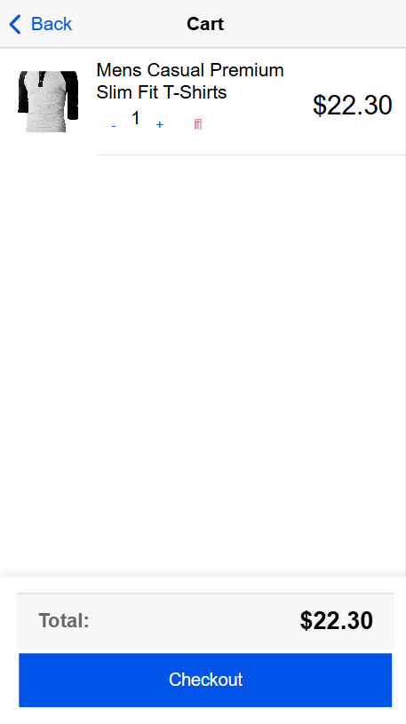

# IONICApp-ECommerce_FakeStore

Esta es una aplicación de e-commerce desarrollada con Ionic que permite gestionar productos, filtrarlos por categorías (a través de una API), agregar productos a un carrito de compra, simular un proceso de pago y mostrar un resumen de la compra. El objetivo de este proyecto es implementar las funcionalidades fundamentales de una tienda en línea.

## Funcionalidades

- **Listado de productos:** La aplicación muestra una lista de productos obtenida desde una API.
- **Filtrado por categorías**: Los productos se pueden filtrar según diferentes categorías, lo que se gestiona a través de la API.
- **Carrito de compras:** Los usuarios pueden agregar productos al carrito y visualizar los artículos seleccionados.
- **Simulación de pago:** Se incluye una funcionalidad para simular el pago de la compra (sin integrar un sistema real de pagos).
- **Resumen de compra:** Después de completar el pago simulado, se muestra una página con un resumen de la compra, incluyendo los productos adquiridos y el total de la compra.

## Tecnologías Usadas

- **Ionic Framework:** Para el desarrollo de la aplicación móvil.
- **Angular:** Framework para la construcción de la aplicación, ya que Ionic está basado en Angular.
- **API [FakeStore](https://fakestoreapi.com/docs):** Utilizada para obtener productos y categorías.

## Instalación

### Clonar el repositorio:

```
git clone https://github.com/tuusuario/tu-repositorio.git
```

Accede al directorio del proyecto:

```
cd tu-repositorio
```

### Instalar las dependencias:

```
npm install
```

Iniciar la aplicación: Para correr la aplicación en el navegador:

```
ionic serve
```

## Capturas de Pantalla







